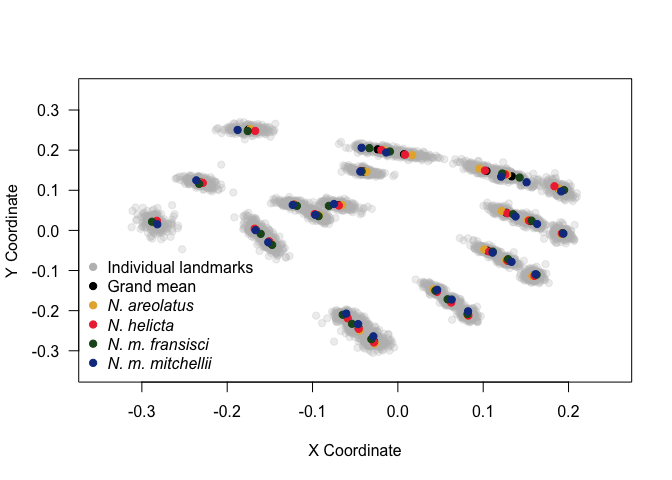
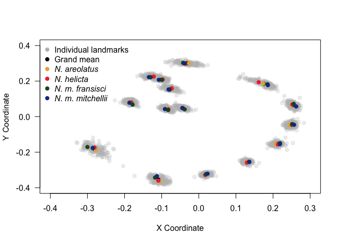
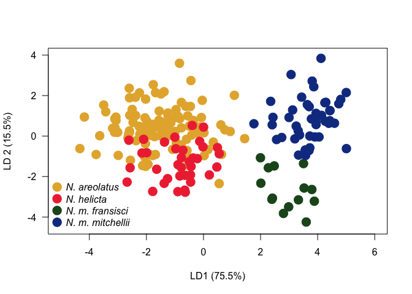
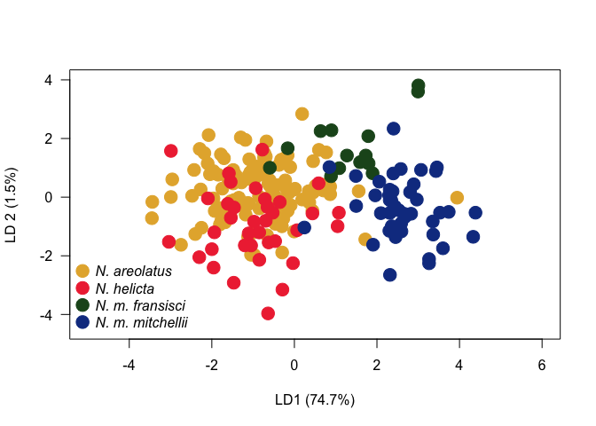
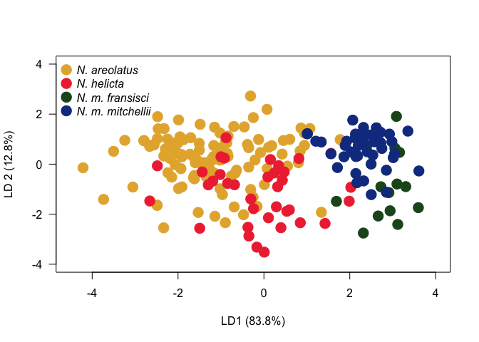
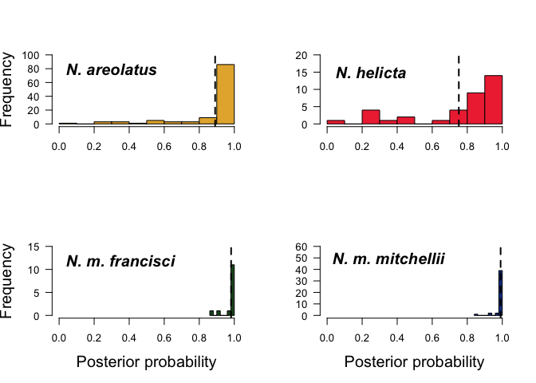
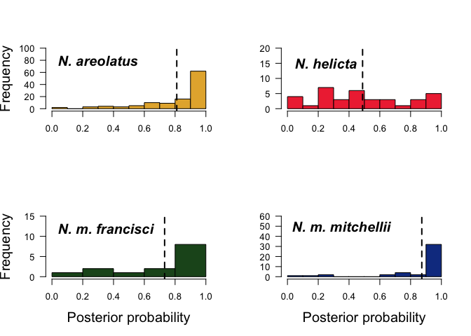
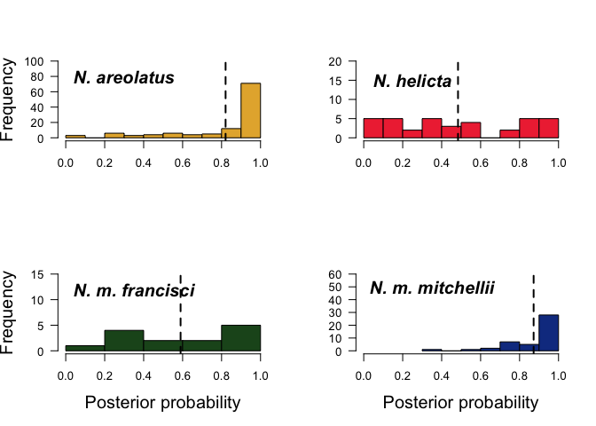
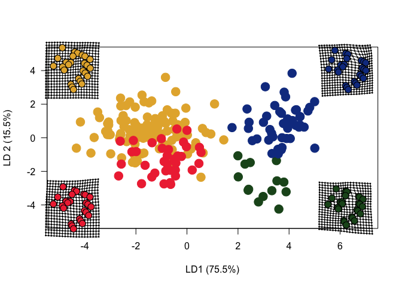
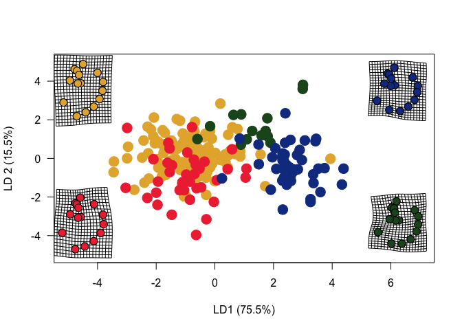

Hamm *et al.* (in prep)

About this project: This code describes the morphometric analyses of taxa within the butterfly genus *Neonympha*. These analyses are:

1. Geometric morphometric analysis using **Type 1** landmarks placed on the ventral hindwings of:

    1. **pattern characters**, where elements of the Central Symmetry System (CSS) intersect with wing veins. n = 26 landmarks.
    1. **structural characters**, such as vein-vein intersections and where  a vein terminate at wing margin. n = 15 landmarks.

1. Analysis involving **border ocelli** (eye spots).

1. Comparative methods analysis incorporating the phylogeny of *Neonympha* from [Hamm et al. 2013](https://www.researchgate.net/publication/258044323_Conservation_Genetics_and_the_Implication_for_Recovery_of_the_Endangered_Mitchell%27s_Satyr_Butterfly_Neonympha_mitchellii_mitchellii).


 The four taxa included in this study were:
 
- *N. areolatua* ( Georgia satyr)
- *N. helicta* (Helicta satyr)
- *N. mitchellii mitchellii* (Mitchell's satyr)
- *N. mithcellii francisci* (St. Francis' satyr)


# Preliminaries

## Load packages

```r
set.seed(8762432)
library("geomorph")
library("tidyverse")
library("MASS")
library("spaceMovie")
```


## Load data


We will be working with three data sets:

- `Pattern`
- `Structure`
- `Coavariate`

We want to conduct our analyses on the same individuals throughout the study. After loading all data sets we will filter the to retain only individuals that are present in all the data sets. 

### `Pattern` raw data

```r
Pattern_raw <- read.csv("../data/geomorph/Pattern_raw.csv", header = TRUE) 
dim(Pattern_raw)
```

```
## [1] 221  53
```

For the `pattern` data set, we placed 26 Type 1 landmarks on the ventral hindwing where elements of the Central Symmetry System (CSS) intersect with wing veins. We landmarked a total of 221 individual male *Neonympha* butterflies.

This data frame contains a lot of information, some we need and some we don't:

- Column 1 - `Id` - A three part individual specimen Id. 
  Ex. `N.ar_AL_66` where:
    - `N.ar` is the species (*N. areolata* in this case). 
    - `_AL` is the US state the specimen was collected in (Alabama in this case). 
    - `_66` is the speciment ID (the 66th specimen I imaged).
- Column 2:53 - The unaligned landmarks for `pattern` data. Column headers in the `pattern` data set start with `pRawCoord`. There are 26 landmarks with X & Y coordinates. Landmarks were placed using the program `tpsDig`. 

### `Structure` raw data

```r
Structure_raw <- read.csv("../data/geomorph/Structure_raw.csv", header = TRUE)
dim(Structure_raw)
```

```
## [1] 215  31
```

For the `structure` data set we placedn 15 Type 1 landmarks on the ventral hind wing where there were vein-vein intersections and where a vein terminate at the wing margin. Column headers in the `structure` data set start with `sRawCoord`. We landmarked a total of 215 male *Neonympha* butterflies. 

### `Covariate` raw data

```r
Covariate_data <- read.csv("../data/geomorph/BO0_12_Dec.csv", header = TRUE)
dim(Covariate_data) 
```

```
## [1] 323  21
```

We took measurements from 323 male *Neonympha* butterflies for the area, length, and width of any border ocellus. If we want to describe border ocellus information for the geuns *Neonympha* we can use all the data, but if we want to consider how these data interact with any of the morphometric data we acquired we will need to used the `Combined_data` object we create below. 

The data in this object are:

- Column 1 - `Id`
- Column 2 - `Taxon` - The species code:
    - `N.ar` = *N. areolatus*
    - `N.he` = *N. helicta*
    - `N.mi` = *N. m. mitchellii*
    - `N.fr` = *N. m. francisi*
- Column 3:8 - `BO1 - BO6` - Area covered by border ocellus in mm^2^ starting with the anterior most wing cell.
- Column 9, 11, 13, 15, 17, 19 - `L` - Length in mm of the ocellus. Ex. `B5L` represents length of ocellus in cell 5.
- Column 10, 12, 14, 16, 18, 20 - `W` - Width in mm of the ocellus. Ex. `B5W` represents width of ocellus in cell 5. 
- Column 21 - North latitude where sample was collected.

### Merging data

The key (a unique variable used to connect tables) for all our data sets is `Id`. This will by the `by = ` in our joins.


```r
Landmark_data <- merge(x = Pattern_raw, y = Structure_raw, by = "Id")
dim(Landmark_data)
```

```
## [1] 210  83
```

```r
Combined_data <- merge(x = Landmark_data, y = Covariate_data, by = "Id")
dim(Combined_data)
```

```
## [1] 208 103
```


## Procrustes superimposition

### `Pattern` data

We will now conduct our Procrustes fit using the `geomorph` package. First we need to create an array and then conduct our fit. 


```r
Pattern_array <- arrayspecs(Combined_data[, 2:53], p = 26, k = 2)

Pattern_gpa <- gpagen(Pattern_array, PrinAxes = FALSE, Proj = TRUE, ProcD = TRUE, print.progress = FALSE)

dimnames(Pattern_array)[[3]] <- Combined_data$Taxon
Pattern_2d <- two.d.array(Pattern_gpa$coords)
rownames(Pattern_2d) <- Combined_data$Taxon
```

### `Structure` data


```r
Structure_array <- arrayspecs(Combined_data[, 54:83], p = 15, k = 2)

Structure_gpa <- gpagen(Structure_array, PrinAxes = FALSE, Proj = TRUE, ProcD = TRUE, print.progress = FALSE)

dimnames(Structure_array)[[3]] <- Combined_data$Taxon
Structure_2d <- two.d.array(Structure_gpa$coords)
rownames(Structure_2d) <- Combined_data$Taxon
```

### Phylogenetic data

Import the species level phylogeny from Hamm et *al.* 2013. Because this is such a small tree it isn't really possible to test values of $\lambda$ (the smooting parameter) to use penalized likelihood (Sanderson 2002). So we will force it to be an ultrametric tree. 

```r
# Neonympha_phylogeny <- read.nexus("../data/MSB_tree2.tre")
# is.ultrametric(Neonympha_phylogeny)
# 
# Neonympha_ultrametric_1 <- chronopl(Neonympha_phylogeny, lambda = 1, iter.max = 1e4, CV = TRUE) # Lambda of 1 implies highly variable rates among lineages
# 
# plot(Neonympha_ultrametric_1)
# is.ultrametric(Neonympha_ultrametric_1)
# Neonympha_ultrametric_1$edge_length <- c(0.4, 0.6, 0.1, 0.15, 0.001, 0.6, 1) # Manually add edge lengths from Hamm et al. 2014.
# 
# Neonympha_ultrametric_0 <- chronopl(Neonympha_phylogeny, lambda = 0, age.min = 1, age.max = NULL, tol = 1e-8, eval.max = 1000, iter.max = 1e4, CV = TRUE)
# plot(Neonympha_ultrametric_0)
# is.ultrametric(Neonympha_ultrametric_0)
```


# Data Visualization


## `Pattern` data

A plot of all superimposed landmarks and the mean landmark for each species.


```r
N_ar_p_mean <- colMeans(Pattern_2d[Combined_data$Taxon == "N.ar", ])
N_he_p_mean <- colMeans(Pattern_2d[Combined_data$Taxon == "N.he", ])
N_fr_p_mean <- colMeans(Pattern_2d[Combined_data$Taxon == "N.fr", ])
N_mi_p_mean <- colMeans(Pattern_2d[Combined_data$Taxon == "N.mi", ])

plot(colMeans(Pattern_2d[c(seq(1, 51, 2)), ]), colMeans(Pattern_2d[c(seq(2, 52, 2)), ]), type = 'n', xlab = 'X Coordinate', ylab ='Y Coordinate', xlim = c(-0.35, 0.25), ylim = c(-0.35, 0.35), las = 1)
  points(as.matrix(Pattern_2d[, c(seq(1, 51, 2)) ]), pch = 19, as.matrix(Pattern_2d[, c(seq(2, 52, 2)) ]), col = rgb(0.745098, 0.745098, 0.745098, 0.25))
  points(colMeans(Pattern_2d[, c(seq(1, 51, 2)) ]), pch = 19, colMeans(Pattern_2d[, c(seq(2, 52, 2)) ]), col = "black")	
  points(N_ar_p_mean[ c(seq(1, 51, 2))] , N_ar_p_mean[ c(seq(2, 52, 2))] , pch = 19, col = SW_palette("Main")[1]) 
  points(N_he_p_mean[ c(seq(1, 51, 2))] , N_he_p_mean[ c(seq(2, 52, 2))] , pch = 19, col = SW_palette("Inquisitor")[1]) 
  points(N_fr_p_mean[ c(seq(1, 51, 2))] , N_fr_p_mean[ c(seq(2, 52, 2))] , pch = 19, col = SW_palette("ROTJ")[3]) 
  points(N_mi_p_mean[ c(seq(1, 51, 2))] , N_mi_p_mean[ c(seq(2, 52, 2))] , pch = 19, col = SW_palette("TESB")[8]) 
  legend('bottomleft', legend = c('Individual landmarks','Grand mean', expression(paste(italic('N. areolatus'))), expression(paste(italic('N. helicta'))), expression(paste(italic('N. m. fransisci'))), expression(paste(italic('N. m. mitchellii')))), col = c('grey','black', SW_palette("Main")[1], SW_palette("Inquisitor")[1], SW_palette("ROTJ")[3], SW_palette("TESB")[8]), pch = 19, bty = 'n')
```




## `Structure` data

A plot of all superimposed landmarks and the mean landmark for each species.

```r
N_ar_s_mean <- colMeans(Structure_2d[Combined_data$Taxon == "N.ar", ])
N_he_s_mean <- colMeans(Structure_2d[Combined_data$Taxon == "N.he", ])
N_fr_s_mean <- colMeans(Structure_2d[Combined_data$Taxon == "N.fr", ])
N_mi_s_mean <- colMeans(Structure_2d[Combined_data$Taxon == "N.mi", ])

plot(colMeans(Structure_2d[c(seq(1, 29, 2)), ]), colMeans(Structure_2d[c(seq(2, 30, 2)), ]), type = 'n', xlab = 'X Coordinate', ylab ='Y Coordinate', xlim = c(-0.4, 0.3), ylim = c(-0.4, 0.4), las = 1)
  points(as.matrix(Structure_2d[, c(seq(1, 29, 2)) ]), pch = 19, as.matrix(Structure_2d[, c(seq(2, 30, 2)) ]), col = rgb(0.745098, 0.745098, 0.745098, 0.25))
  points(colMeans(Structure_2d[, c(seq(1, 29, 2)) ]), pch = 19, colMeans(Structure_2d[, c(seq(2, 30, 2)) ]), col = "black")	
  points(N_ar_s_mean[ c(seq(1, 29, 2))] , N_ar_s_mean[ c(seq(2, 30, 2))] , pch = 19, col = SW_palette("Main")[1])
  points(N_he_s_mean[ c(seq(1, 29, 2))] , N_he_s_mean[ c(seq(2, 30, 2))] , pch = 19, col = SW_palette("Inquisitor")[1]) 
  points(N_fr_s_mean[ c(seq(1, 29, 2))] , N_fr_s_mean[ c(seq(2, 30, 2))] , pch = 19, col = SW_palette("ROTJ")[3]) 
  points(N_mi_s_mean[ c(seq(1, 29, 2))] , N_mi_s_mean[ c(seq(2, 30, 2))] , pch = 19, col = SW_palette("TESB")[8]) 
  legend('topleft', legend = c('Individual landmarks','Grand mean', expression(paste(italic('N. areolatus'))), expression(paste(italic('N. helicta'))), expression(paste(italic('N. m. fransisci'))), expression(paste(italic('N. m. mitchellii')))), col = c('grey','black', SW_palette("Main")[1], SW_palette("Inquisitor")[1], SW_palette("ROTJ")[3], SW_palette("TESB")[8]), pch = 19, bty = 'n')
```




# Analyses


## Linear Discriminant Analysis

### `Pattern`

```r
# The first step is to conduct a Principle Componants Analysis (PCA)
Pattern_pca <- prcomp(Pattern_2d)
summary(Pattern_pca)$importance[, 1:4]
```

```
##                               PC1        PC2        PC3        PC4
## Standard deviation     0.04193424 0.02885562 0.02288956 0.01954378
## Proportion of Variance 0.33585000 0.15903000 0.10007000 0.07295000
## Cumulative Proportion  0.33585000 0.49488000 0.59494000 0.66790000
```

```r
# Recall that the last four PC dimensions (49:52 in this case) are empty when dealing with morphometric data - we remove these to avoid deficient dimensions

Pattern_pca_shape <- cbind(Combined_data[, c(1, 84)], Pattern_pca$x[, 1:48])

Pattern_lda <- lda(as.matrix(Pattern_pca_shape[, 3:50]), Pattern_pca_shape$Taxon, method ="mle" )

Pattern_lda_scores <- as.matrix(Pattern_pca_shape[, 3:50]) %*% as.matrix(Pattern_lda$scaling) # Here we use matrix multiplication to multiply the Pattern pcs by the lda scaling. This gives us LDA positions for each individual.
Pattern_pca_lda <- cbind(Pattern_pca_shape, Pattern_lda_scores)

plot(Pattern_pca_lda$LD1, Pattern_pca_lda$LD2, col = c(SW_palette("Main")[1], SW_palette("ROTJ")[3], SW_palette("Inquisitor")[1], SW_palette("TESB")[8])[Pattern_pca_lda$Taxon], pch = 19, xlab= 'LD1 (75.5%)', ylab ='LD 2 (15.5%)', xlim =c(-5, 6), ylim = c(-4.5, 4), cex = 2, las = 1 ) # % of variance explained at bottom of output when calling Pattern_lda
  legend('bottomleft', legend = c(expression(paste(italic('N. areolatus'))), expression(paste(italic('N. helicta'))), expression(paste(italic('N. m. fransisci'))), expression(paste(italic('N. m. mitchellii')))), bty = 'n', pch = 19, col = c(SW_palette("Main")[1], SW_palette("Inquisitor")[1], SW_palette("ROTJ")[3], SW_palette("TESB")[8]), pt.cex = 2)
```



### `Structure` 

```r
Structure_pca <- prcomp(Structure_2d)
summary(Structure_pca)$importance[, 1:4]
```

```
##                               PC1        PC2        PC3       PC4
## Standard deviation     0.03460441 0.03000025 0.02357017 0.0203136
## Proportion of Variance 0.26562000 0.19964000 0.12323000 0.0915300
## Cumulative Proportion  0.26562000 0.46527000 0.58850000 0.6800300
```

```r
Structure_pca_shape <- cbind(Combined_data[, c(1, 84)], Structure_pca$x[, 1:26])

Structure_lda <- lda(as.matrix(Structure_pca_shape[, 3:28]), Structure_pca_shape$Taxon, method ="mle" )

Structure_lda_scores <- as.matrix(Structure_pca_shape[, 3:28]) %*% as.matrix(Structure_lda$scaling)
Structure_pca_lda <- cbind(Structure_pca_shape, Structure_lda_scores)

plot(Structure_pca_lda$LD1, Structure_pca_lda$LD2, col = c(SW_palette("Main")[1], SW_palette("ROTJ")[3], SW_palette("Inquisitor")[1], SW_palette("TESB")[8])[Structure_pca_lda$Taxon], pch = 19, xlab= 'LD1 (74.7%)', ylab ='LD 2 (1.5%)', xlim =c(-5, 6), ylim = c(-4.5, 4), cex = 2, las = 1 )
  legend('bottomleft', legend = c(expression(paste(italic('N. areolatus'))), expression(paste(italic('N. helicta'))), expression(paste(italic('N. m. fransisci'))), expression(paste(italic('N. m. mitchellii')))), bty = 'n', pch = 19, col = c(SW_palette("Main")[1], SW_palette("Inquisitor")[1], SW_palette("ROTJ")[3], SW_palette("TESB")[8]), pt.cex = 2)
```



### `Covariate`

```r
# Not all individuals have border ocelli in cells 1 and 2, so we will omit those from this analysis. We will select the area, lenght and width of border ocelli from cells 3:6.

Cov_ALW <- Combined_data[, c(87:90, 95:102)]
Cov_ALW_pca <- prcomp(Cov_ALW)
summary(Cov_ALW_pca)$importance[, 1:4]
```

```
##                             PC1       PC2       PC3       PC4
## Standard deviation     1.218382 0.7383672 0.3681858 0.3300342
## Proportion of Variance 0.613290 0.2252400 0.0560100 0.0450000
## Cumulative Proportion  0.613290 0.8385400 0.8945400 0.9395400
```

```r
Cov_ALW_shape <- cbind(Combined_data[, c(1, 84)], Cov_ALW_pca$x) # These data are not morphometric, so we don't need to remove dimensions.

Cov_ALW_lda <- lda(as.matrix(Cov_ALW_shape[, 3:14]), Cov_ALW_shape$Taxon, method = "mle")

Cov_ALW_lda_scores <- as.matrix(Cov_ALW_shape[, 3:14]) %*% as.matrix(Cov_ALW_lda$scaling)

Cov_ALW_pca_lda <- cbind(Cov_ALW_shape, Cov_ALW_lda_scores)

plot(Cov_ALW_pca_lda$LD1, Cov_ALW_pca_lda$LD2, col = c(SW_palette("Main")[1], SW_palette("ROTJ")[3], SW_palette("Inquisitor")[1], SW_palette("TESB")[8])[Cov_ALW_pca_lda$Taxon], xlim= c(-4.5, 4), ylim = c(-4, 4),pch = 19, xlab= "LD1 (83.8%)", ylab ="LD 2 (12.8%)", cex = 2, las = 1 )
  legend('topleft', legend = c(expression(paste(italic('N. areolatus'))), expression(paste(italic('N. helicta'))), expression(paste(italic('N. m. fransisci'))), expression(paste(italic('N. m. mitchellii')))), bty = 'n', pch = 19, col = c(SW_palette("Main")[1], SW_palette("Inquisitor")[1], SW_palette("ROTJ")[3], SW_palette("TESB")[8]), pt.cex = 2)
```




## Discriminant analysis

### `Pattern`

```r
Pattern_DF <- predict(Pattern_lda)
Pattern_pca_DF <- cbind(Pattern_pca_lda, Pattern_DF$posterior)

N_ar_P_DF <- Pattern_pca_DF[Pattern_pca_DF$Taxon == "N.ar", ]
N_he_P_DF <- Pattern_pca_DF[Pattern_pca_DF$Taxon == "N.he", ]
N_fr_P_DF <- Pattern_pca_DF[Pattern_pca_DF$Taxon == "N.fr", ]
N_mi_P_DF <- Pattern_pca_DF[Pattern_pca_DF$Taxon == "N.mi", ]

par(mfrow = c(2, 2))
hist(N_ar_P_DF$N.ar, col = SW_palette("Main")[1], main = "", xlab = "", ylab = "Frequency", ylim = c(0, 100), las = 1, cex.lab = 1.5)
  text(0.3, 80, expression(paste(bolditalic("N. areolatus"))), cex = 1.5)
  abline(v = mean(N_ar_P_DF$N.ar), lty = 2, lwd = 2)

hist(N_he_P_DF$N.he, col = SW_palette("Inquisitor")[1], ylab = "", xlab = "", main = "", ylim = c(0, 20), las = 1)
  text(0.25, 15, expression(paste(bolditalic("N. helicta"))), cex = 1.5)
  abline(v = mean(N_he_P_DF$N.he), lty = 2, lwd = 2)

hist(N_fr_P_DF$N.fr, col = SW_palette("ROTJ")[3], main = "", xlab = "Posterior probability", ylab = "Frequency", ylim = c(0, 15), xlim = c(0, 1), las = 1, cex.lab = 1.5)
  text(0.35, 12, expression(paste(bolditalic("N. m. francisci"))), cex = 1.5)
  abline(v = mean(N_fr_P_DF$N.fr), lty = 2, lwd = 2)

hist(N_mi_P_DF$N.mi, col = SW_palette("TESB")[8], main = "", ylab = "", xlab = "Posterior probability", ylim = c(0, 60), xlim = c(0, 1), las = 1, cex.lab = 1.5)
  text(0.35, 50, expression(paste(bolditalic("N. m. mitchellii"))), cex = 1.5)
  abline(v = mean(N_mi_P_DF$N.mi), lty = 2, lwd = 2)
```




### `Structure`

```r
Structure_DF <- predict(Structure_lda)
Structure_pca_DF <- cbind(Structure_pca_lda, Structure_DF$posterior)

N_ar_S_DF <- Structure_pca_DF[Structure_pca_DF$Taxon == "N.ar", ]
N_he_S_DF <- Structure_pca_DF[Structure_pca_DF$Taxon == "N.he", ]
N_fr_S_DF <- Structure_pca_DF[Structure_pca_DF$Taxon == "N.fr", ]
N_mi_S_DF <- Structure_pca_DF[Structure_pca_DF$Taxon == "N.mi", ]

par(mfrow = c(2, 2))
hist(N_ar_S_DF$N.ar, col = SW_palette("Main")[1], main = "", xlab = "", ylab = "Frequency", ylim = c(0, 100), las = 1, cex.lab = 1.5)
  text(0.3, 80, expression(paste(bolditalic("N. areolatus"))), cex = 1.5)
  abline(v = mean(N_ar_S_DF$N.ar), lty = 2, lwd = 2)

hist(N_he_S_DF$N.he, col = SW_palette("Inquisitor")[1], ylab = "", xlab = "", main = "", ylim = c(0, 20), las = 1)
  text(0.25, 15, expression(paste(bolditalic("N. helicta"))), cex = 1.5)
  abline(v = mean(N_he_S_DF$N.he), lty = 2, lwd = 2)

hist(N_fr_S_DF$N.fr, col = SW_palette("ROTJ")[3], main = "", xlab = "Posterior probability", ylab = "Frequency", ylim = c(0, 15), xlim = c(0, 1), las = 1, cex.lab = 1.5)
  text(0.35, 12, expression(paste(bolditalic("N. m. francisci"))), cex = 1.5)
  abline(v = mean(N_fr_S_DF$N.fr), lty = 2, lwd = 2)

hist(N_mi_S_DF$N.mi, col = SW_palette("TESB")[8], main = "", ylab = "", xlab = "Posterior probability", ylim = c(0, 60), xlim = c(0, 1), las = 1, cex.lab = 1.5)
  text(0.35, 50, expression(paste(bolditalic("N. m. mitchellii"))), cex = 1.5)
  abline(v = mean(N_mi_S_DF$N.mi), lty = 2, lwd = 2)
```




#### `Covariate`

```r
Cov_ALW_DF <- predict(Cov_ALW_lda)
Cov_ALW_pca_DF <- cbind(Cov_ALW_pca_lda, Cov_ALW_DF$posterior)

N_ar_Cov_DF <- Cov_ALW_pca_DF[Cov_ALW_pca_DF$Taxon == "N.ar", ]
N_he_Cov_DF <- Cov_ALW_pca_DF[Cov_ALW_pca_DF$Taxon == "N.he", ]
N_fr_Cov_DF <- Cov_ALW_pca_DF[Cov_ALW_pca_DF$Taxon == "N.fr", ]
N_mi_Cov_DF <- Cov_ALW_pca_DF[Cov_ALW_pca_DF$Taxon == "N.mi", ]

par(mfrow = c(2, 2))
hist(N_ar_Cov_DF$N.ar, col = SW_palette("Main")[1], main = "", xlab = "", ylab = "Frequency", ylim = c(0, 100), las = 1, cex.lab = 1.5)
  text(0.3, 80, expression(paste(bolditalic("N. areolatus"))), cex = 1.5)
  abline(v = mean(N_ar_Cov_DF$N.ar), lty = 2, lwd = 2)

hist(N_he_Cov_DF$N.he, col = SW_palette("Inquisitor")[1], ylab = "", xlab = "", main = "", ylim = c(0, 20), las = 1)
  text(0.25, 15, expression(paste(bolditalic("N. helicta"))), cex = 1.5)
  abline(v = mean(N_he_Cov_DF$N.he), lty = 2, lwd = 2)

hist(N_fr_Cov_DF$N.fr, col = SW_palette("ROTJ")[3], main = "", xlab = "Posterior probability", ylab = "Frequency", ylim = c(0, 15), xlim = c(0, 1), las = 1, cex.lab = 1.5)
  text(0.35, 12, expression(paste(bolditalic("N. m. francisci"))), cex = 1.5)
  abline(v = mean(N_fr_Cov_DF$N.fr), lty = 2, lwd = 2)

hist(N_mi_Cov_DF$N.mi, col = SW_palette("TESB")[8], main = "", ylab = "", xlab = "Posterior probability", ylim = c(0, 60), xlim = c(0, 1), las = 1, cex.lab = 1.5)
  text(0.35, 50, expression(paste(bolditalic("N. m. mitchellii"))), cex = 1.5)
  abline(v = mean(N_mi_Cov_DF$N.mi), lty = 2, lwd = 2)
```




## Procrustes ANOVA

### Create the `geomorph.data.frame`

```r
Neonympha_data.frame <- geomorph.data.frame(Pattern = Pattern_gpa$coords, Pattern_logCS = log(Pattern_gpa$Csize), Structure = Structure_gpa$coords, Structure_logCS = log(Structure_gpa$Csize), Taxon = Combined_data$Taxon, BO_size = Combined_data[, 87:90], BO_LW = Combined_data[, 95:102], Lat = Combined_data$Lat)
attributes(Neonympha_data.frame)
```

```
## $names
##  [1] "BO_size.BO3"     "BO_size.BO4"     "BO_size.BO5"    
##  [4] "BO_size.BO6"     "BO_LW.B3L"       "BO_LW.B3W"      
##  [7] "BO_LW.B4L"       "BO_LW.B4W"       "BO_LW.B5L"      
## [10] "BO_LW.B5W"       "BO_LW.B6L"       "BO_LW.B6W"      
## [13] "Pattern"         "Pattern_logCS"   "Structure"      
## [16] "Structure_logCS" "Taxon"           "Lat"            
## 
## $class
## [1] "geomorph.data.frame"
```

### `Pattern`

#### `Pattern` and by taxon

```r
# apd_1 <- advanced.procD.lm(f1 = Pattern ~ 1, Pattern ~ Taxon, data = Neonympha_data.frame, iter = 1e4, seed = 76234, print.progress = FALSE)
# summary(apd_1)
```
Including taxon does a better job explaining `pattern` variation than a null model.

#### `Pattern` by taxon and size (factor interaction)

```r
# apd_1a <- advanced.procD.lm(f1 = Pattern ~ Taxon * Pattern_logCS, f2 = Pattern ~ Taxon + Pattern_logCS, groups = ~Taxon * Pattern_logCS, data = Neonympha_data.frame, iter = 1e4, seed = 76234, print.progress = FALSE)
# summary(apd_1a)
```

#### Pattern centroid size by taxon and latitude

```r
# apd_1b <-  advanced.procD.lm(f1 = Pattern_logCS ~ Taxon * Lat, f2 = Pattern_logCS ~ Taxon + Lat, data = Neonympha_data.frame, groups = ~Taxon * Lat, iter = 1e4, seed = 76234, print.progress = FALSE)
# summary(apd_1b)
```

### `Structure`

#### `Structure` by taxon

```r
# apd_2 <- advanced.procD.lm(f1 = Structure ~ 1, Structure ~ Taxon, data = Neonympha_data.frame, iter = 1e4, seed = 76234, print.progress = FALSE)
# summary(apd_2)
```
Including taxon does a better job explaining `structure` variation than a null model. 

### `Covariate` size by taxon

```r
# apd_3 <- advanced.procD.lm(f1 = Combined_data[, 87:90] ~ 1, Combined_data[, 87:90] ~ Taxon, data = Neonympha_data.frame, iter = 1e4, seed = 76234, print.progress = FALSE)
# summary(apd_3)
```

### `Covariate`

#### `Covariate` lenght and width by taxon

```r
# apd_4 <- advanced.procD.lm(f1 = Combined_data[, 95:102] ~ 1, Combined_data[, 95:102] ~ Taxon, data = Neonympha_data.frame, iter = 1e4, seed = 76234, print.progress = FALSE)
# summary(apd_4)
```


# Misc.


## Warp grids


### `Pattern`

```r
# Need to do calculate the mean shape for each taxon
Pp <- dim(Pattern_gpa$coords)[1]
Pk <- dim(Pattern_gpa$coords)[2]
P_group <- Combined_data$Taxon
PY <- array(NA, dim = c(Pp, Pk, length(levels(P_group))))
dimnames(PY)[[3]] <- levels(P_group)

for(i in 1:length(levels(P_group))){
	grp <- Pattern_2d[which(P_group == levels(P_group)[i]), ]
	foo <- arrayspecs(grp, Pp, Pk)
	PY[, , i] <- mshape(foo)
}
dim(PY)
```

```
## [1] 26  2  4
```

```r
P_reference <- mshape(Pattern_gpa$coords) # Mean shape for Neonympha pattern

Nar_PY <- PY[, , 1]
Nhe_PY <- PY[, , 3]
Nfr_PY <- PY[, , 2]
Nmi_PY <- PY[, , 4]

plot(Pattern_pca_lda$LD1, Pattern_pca_lda$LD2, col = c(SW_palette("Main")[1], SW_palette("ROTJ")[3], SW_palette("Inquisitor")[1], SW_palette("TESB")[8])[Pattern_pca_lda$Taxon], pch = 19, xlab= 'LD1 (75.5%)', ylab ='LD 2 (15.5%)', xlim =c(-5, 7), ylim = c(-5, 5), cex = 2, las = 1 )

# Warp grid for N. areolata
par(fig = c(0.08, 0.28, 0.58, 0.93), new = TRUE)
plot.new()
```

```
## Error in plot.new(): figure margins too large
```

```r
par(mar = c(1, 1, 1, 1))
N_ar_pars <- gridPar(tar.pt.bg = SW_palette("Main")[1], tar.pt.size = 1.5)
plotRefToTarget(P_reference, Nar_PY, method = "TPS", mag = 3, gridPars = N_ar_pars)

# Warp grid for N. helicta
par(fig = c(0.08, 0.28, 0.1, 0.45), new = TRUE)
plot.new()
par(mar = c(1, 1, 1, 1))
N_he_pars <- gridPar(tar.pt.bg = SW_palette("Inquisitor")[1], tar.pt.size = 1.5)
plotRefToTarget(P_reference, Nhe_PY, method = "TPS", mag = 3, gridPars = N_he_pars)

# Warp grid for N. m. francisi
par(fig = c(0.76, 0.96, 0.1, 0.45), new = TRUE)
plot.new()
par(mar = c(1, 1, 1, 1))
N_fr_pars <- gridPar(tar.pt.bg = SW_palette("ROTJ")[3], tar.pt.size = 1.5)
plotRefToTarget(P_reference, Nfr_PY, method = "TPS", mag = 3, gridPars = N_fr_pars)

# Warp grid for N. m. mitchellii
par(fig = c(0.76, 0.96, 0.58, 0.93), new = TRUE)
plot.new()
par(mar = c(1, 1, 1, 1))
N_mi_pars <- gridPar(tar.pt.bg = SW_palette("TESB")[8], tar.pt.size = 1.5)
plotRefToTarget(P_reference, Nmi_PY, method = "TPS", mag = 3, gridPars = N_mi_pars)
```




### `Structure`

```r
Sp <- dim(Structure_gpa$coords)[1]
Sk <- dim(Structure_gpa$coords)[2]
S_group <- Combined_data$Taxon
SY <- array(NA, dim = c(Sp, Sk, length(levels(S_group))))
dimnames(SY)[[3]] <- levels(S_group)

for(i in 1:length(levels(S_group))){
	grp <- Structure_2d[which(S_group == levels(S_group)[i]), ]
	foo <- arrayspecs(grp, Sp, Sk)
	SY[, , i] <- mshape(foo)
}
dim(SY)
```

```
## [1] 15  2  4
```

```r
S_reference <- mshape(Structure_gpa$coords) # Mean shape for Neonympha Structure

Nar_SY <- SY[, , 1]
Nhe_SY <- SY[, , 3]
Nfr_SY <- SY[, , 2]
Nmi_SY <- SY[, , 4]

plot(Structure_pca_lda$LD1, Structure_pca_lda$LD2, col = c(SW_palette("Main")[1], SW_palette("ROTJ")[3], SW_palette("Inquisitor")[1], SW_palette("TESB")[8])[Structure_pca_lda$Taxon], pch = 19, xlab= 'LD1 (75.5%)', ylab ='LD 2 (15.5%)', xlim =c(-5, 7), ylim = c(-5, 5), cex = 2, las = 1 )

# Warp grid for N. areolata
par(fig = c(0.08, 0.28, 0.55, 0.9), new = TRUE)
plot.new()
```

```
## Error in plot.new(): figure margins too large
```

```r
par(mar = c(1, 1, 1, 1))
plotRefToTarget(S_reference, Nar_SY, method = "TPS", mag = 3, gridPars = N_ar_pars)

# Warp grid for N. helicta
par(fig = c(0.08, 0.28, 0.15, 0.5), new = TRUE)
plot.new()
par(mar = c(1, 1, 1, 1))
plotRefToTarget(S_reference, Nhe_SY, method = "TPS", mag = 3, gridPars = N_he_pars)

# Warp grid for N. m. francisi
par(fig = c(0.76, 0.96, 0.15, 0.5), new = TRUE)
plot.new()
par(mar = c(1, 1, 1, 1))
plotRefToTarget(S_reference, Nfr_SY, method = "TPS", mag = 3, gridPars = N_fr_pars)

# Warp grid for N. m. mitchellii
par(fig = c(0.76, 0.96, 0.55, 0.9), new = TRUE)
plot.new()
par(mar = c(1, 1, 1, 1))
plotRefToTarget(S_reference, Nmi_SY, method = "TPS", mag = 3, gridPars = N_mi_pars)
```



